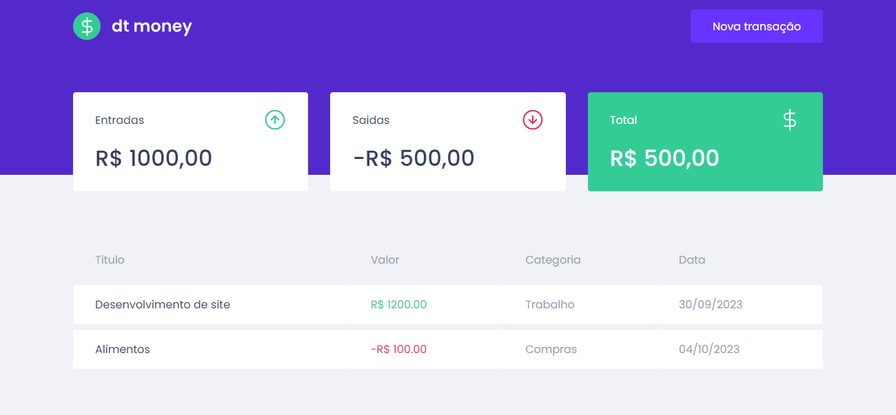

# dt-money

## Objetivo

O resultado final desta aplicação é apresentar um ambiente de controle financeiro de gastos. Nela é apresentado captura de dados de leitura e apresntação de valores com categoria e descrição e data em tabela e resumo de calculo.



## Libs Utilizadas

1- styled components - yarn add styled-components | yarn add @types/styled-components

2- react modal - yarn add react-modal | yarn add @types/react-modal
```
    Configuração:
    
    1- Criar estado(useState):
    const [isNewTransactionModalOpen, setIsNewTransactionModalOpen] = useState(false)

    2- Criar função
    function handleOpenNewTransactionModal(){
        setIsNewTransactionModalOpen(true)
    }

    function handleCloseNewTransactionModal(){
        setIsNewTransactionModalOpen(false)
    }

    3- Liberar a função no botão handleOpen

    4- Importar Modal e Criar componente com propriedade isOpen e onRequestClose

    5- Acressentar no Arquivo principal(App.tsx) o Modal.setAppElement('#root')
```

3- polished - yarn add polished

4- miragejs - yarn add miragejs
```
    Configuração:

    index.tsx -> createServer({
        *models: {
            transaction: Model
        },

        seeds(server){
            server.db.loadData({
                transactions: [
                    {objeto}
                ]
            })
        },
        
        routes(){
            this.namespace = 'api'

            this.get('/transactions', () => {
                return [
                    {objeto}
                ]
            })

            this.post('/transactions', (schema, request) => {
                const data = request.requestBody

                return schema.create('/transaction', data)
            })
        }
    })
    
```

5- axios - yarn add axios

